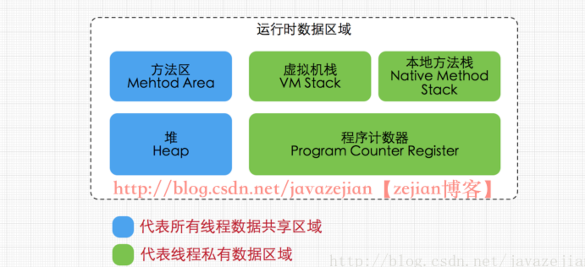

# JAVA内存模型

```
JAVA运行时数据区有五部分构成，1.程序计数器(线程隔离)2.虚拟机栈(线程隔离)3.本地方法栈(线程隔离)4.方法区5.堆
```



### 程序计数器

程序计数器是一块较小的内存，它可以看作是当前线程所执行的字节码的行号指示器。在虚拟机的概念里，字节码解释器工作时就是通过改变这个计数器的值来选取下一条需要执行的字节码指令，分支，循环，跳转，异常处理，线程恢复都依赖这个计数器完成。

每条线程都需要一个独立的程序计数器，各条线程之间计数器互不影响，独立存储。

### 方法区

方法区属于线程共享的内存区域，又称非堆(Non-heap)。主要存储被虚拟机加载的类信息，常量，静态变量，即时编译器编译后的代码数据等。方法区中存在一个运行常量池的区域。当方法区无法满足内存需要时会抛出OutOfMemoryError。

### JVM堆

Java堆也是线程共享的内存区域。它在虚拟机启动的时候创建，是JAVA虚拟机所管理内存的最大一块。几乎所有的对象都存放在这里。也是JVM垃圾回收的区域，所以也称为GC堆。当内存无法满足需求时会抛出OutOfMemoryError。

### 虚拟机栈

属于线程私有的数据区域，与线程同时创建，总数与线程关联，代表JAVA执行的内存模型。每个方法执行时都会创建一个栈帧来存储方法的变量表，操作数栈，动态链接方法，返回值，返回地址等信息。每个方法从调用至结束就对于一个栈帧在虚拟机栈中的入栈和出栈的过程。

